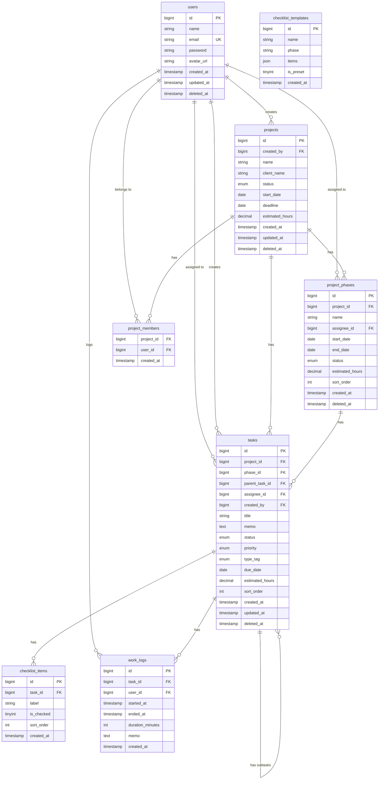

# DB設計

テーブル定義の詳細は `docs/tables/` を参照。

## ER図

## 備考

- **個人タスク**: `tasks.project_id = NULL` で判定。専用テーブルは作らない
- **プロジェクト削除**: ソフトデリート（`deleted_at`）= アーカイブ扱い
- **完了済みタスクの削除**: 物理削除（`forceDelete()`）。未完了タスクはソフトデリート推奨
- **工数粒度**: 0.5h単位（`decimal(5,1)`）
- **サブタスク**: `tasks.parent_task_id` による自己参照（1階層のみ）
- **認証**: JWT（tymon/jwt-auth）。アクセストークン60分、リフレッシュトークン30日
